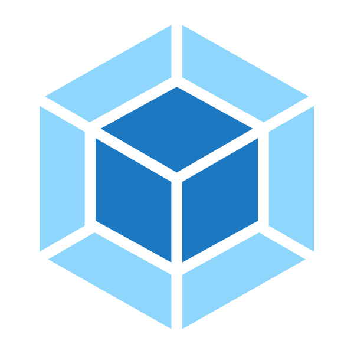

## 全栈工程师——zlican, ican！
👋Hello,this is github belonging to Ling
✨Certainly, is me✨  
>⚡First, I’m an active boy  
>⚡Last, I feel much interested in coding  

### Code Language

 

### **技术栈:**

<a href="https://go.dev/"><code></code></a>
<a href="https://www.tslang.cn/index.html"><code></code></a>
<a href="https://v3.cn.vuejs.org"><code></code></a>
<a href="https://reactjs.org/"><code></code></a>
<a href="https://webpack.js.org/"><code></code></a>
<a href="https://www.docker.com"><code></code></a>

### **Believe**：
*🌱Let's create an excepted future together!*  
